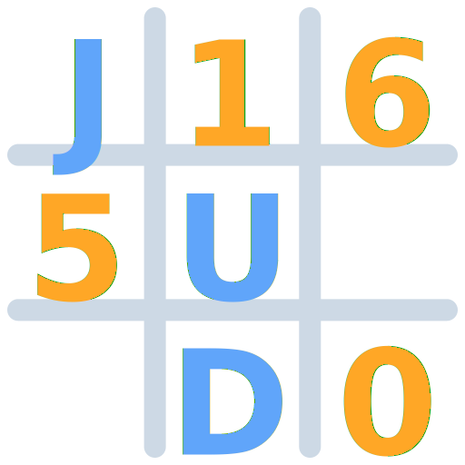

# Jigsudo

  
   
  
<b>Six challenges, one board. Your daily dose of numbers.</b>

  

    
    
    
  

  <a href="https://jigsudo.com/"><b>🚀 Play Jigsudo Now / Juega Ahora 🚀</b></a>

---

## 🇺🇸 English Version

**Jigsudo** is a unique daily logic puzzle experience played in your browser. It’s not just one game—it’s a journey through six interconnected challenges where your progress in one stage directly impacts the next.

### 🎮 The Six Stages of Jigsudo

1.  **Memory**: Start with an empty board. Find Sudoku block pairs to unlock the 9 pieces (3x3 blocks). Finding the center piece automatically fixes it in place.
2.  **Jigsaw**: Place the remaining 8 pieces from your collection onto the board. You must complete the assembly to enable the next challenge.
3.  **Sudoku Core**: Once assembled, solve the Sudoku by completing the grid with numbers 1 to 9, ensuring no repeats in rows, columns, or 3x3 blocks.
4.  **Peaks & Valleys**: On the solved Sudoku, identify the Peaks (numbers larger than their neighbors) and Valleys (smaller than their neighbors). These cells become blocked once found.
5.  **Number Search**: Find hidden number sequences winding through the board, avoiding the cells already blocked by Peaks and Valleys. These also become blocked.
6.  **The Code**: The final challenge activates in the last 4 free cells. Memorize and repeat the flashing sequence, which grows each turn until reaching 7 digits.

### 🚀 Key Features

- **Daily Challenges**: A fresh, uniquely generated puzzle every single day.
- **Global Rankings**: Compete worldwide for the best times (**Daily**, **Monthly**, and **All-Time**).
- **Progression System**: Earn RP (Rank Points) and climb through **15 unique ranks**.
- **Dynamic Themes**: Beautiful glassmorphism UI with full **Dark/Light mode** support.
- **Responsive**: Perfectly optimized for Desktop, Tablet, and Mobile.

### 🛠️ Tech Stack

- **Frontend**: Vanilla JavaScript (ES Modules), HTML5, and CSS3.
- **Backend**: Firebase (Authentication & Cloud Firestore for rankings and sync).
- **CI/CD**: GitHub Actions for daily puzzle generation and automated deployments.

---

## 🇪🇸 Versión en Español

**Jigsudo** es una experiencia única de acertijos lógicos diarios para tu navegador. No es solo un juego, es un viaje a través de seis desafíos interconectados donde tu progreso en una etapa afecta directamente a la siguiente.

### 🎮 Las Seis Etapas de Jigsudo

1.  **Memoria**: Comienza con el tablero vacío. Encuentra pares de bloques sudoku para desbloquear las 9 piezas (bloques 3x3). Al encontrar la pieza central, esta se fija automáticamente en su lugar.
2.  **Rompecabezas**: Coloca las 8 piezas restantes de tu colección en el tablero. Debes completar el ensamblaje para habilitar el siguiente desafío.
3.  **Sudoku**: Con el tablero armado, resuelve el Sudoku completando la cuadrícula con números del 1 al 9 sin repetirlos en filas, columnas o bloques de 3x3.
4.  **Picos y Valles**: Sobre el Sudoku resuelto, identifica los Picos (números mayores que sus vecinos) y Valles (menores que sus vecinos). Al encontrarlos, estas celdas se bloquean.
5.  **Sopa de Números**: Encuentra secuencias numéricas ocultas serpenteando por el tablero, evitando las celdas bloqueadas por los Picos y Valles. Al hallarlas, también se bloquean.
6.  **El Código**: El desafío final se activa en las últimas 4 celdas libres. Memoriza y repite la secuencia que parpadea en el tablero, la cual crece en cada turno hasta llegar a 7 dígitos.

### 🚀 Funciones Principales

- **Desafíos Diarios**: Un puzzle nuevo, generado de forma única, cada día.
- **Clasificación Global**: Compite por los mejores tiempos (**Diario**, **Mensual** e **Histórico**).
- **Sistema de Progresión**: Gana RP (Puntos de Rango) y sube a través de **15 rangos únicos**.
- **Temas Dinámicos**: Interfaz elegante "glassmorphism" con soporte para **Modo Oscuro/Claro**.
- **Responsivo**: Optimizado para PC, Tablet y Móvil.

### 🛠️ Tecnologías

- **Frontend**: JavaScript Vanilla (Módulos ES), HTML5 y CSS3.
- **Backend**: Firebase (Autenticación y Cloud Firestore para rankings y sincronización).
- **CI/CD**: GitHub Actions para la generación diaria de puzzles y despliegues automáticos.

---

  
Developed with ❤️ by <a href="https://github.com/ryakimovicz">Roman Yakimovicz</a>

